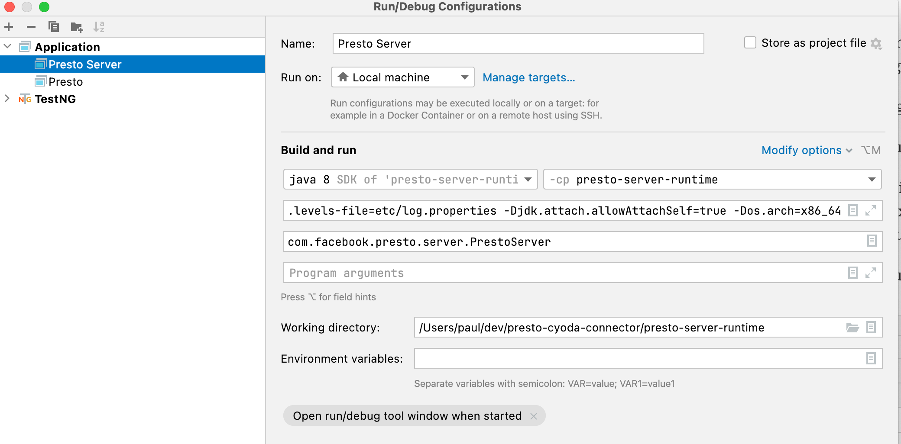

== How to run the Presto server locally

This module mimics the presto-server module, so that we can run the Presto server from the IDE without actually checking out the Presto project.

It configures only the cyoda-presto plugin, so startup is quicker, too.
:-)

.JVM args to pass to the runtime config
[source,properties]
----
-ea
-XX:+UseG1GC
-XX:G1HeapRegionSize=32M
-XX:+UseGCOverheadLimit
-XX:+ExplicitGCInvokesConcurrent
-Xmx2G
-Dconfig=etc/config.properties
-Dlog.levels-file=etc/log.properties
-Djdk.attach.allowAttachSelf=true
----

If you are running on an ARM CPU, you need to add `-Dos.arch=x86_64`