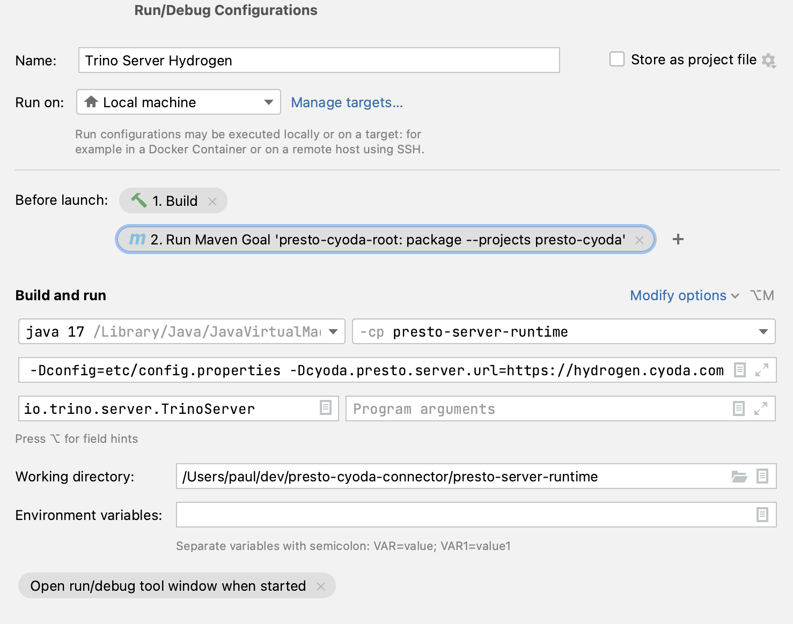

== How to run the Trino server locally

The dependencies in the `pom.xml` have been adjusted to exclude all other plugins and has only the `trino-cyoda` plugin as a dependency.

IMPORTANT: You need to run the maven goal to package the `trino-cyoda` module before running this, so that our connector zipfile is unpacked in the right location (Note the _Run Maven Goal_ in the screenshot).

.JVM args to pass to the runtime config
[source,shell script]
----
-ea
-XX:+UseG1GC
-XX:G1HeapRegionSize=32M
-XX:+UseGCOverheadLimit
-XX:+ExplicitGCInvokesConcurrent
-Xmx2G
-Dlog.levels-file=etc/log.properties
-Djdk.attach.allowAttachSelf=true
-Dconfig=etc/config.properties
----

This has been tested to also work on Apple M1 with an ARM-based CPU.

== Running under Windows
In the run configuration, replace

`io.trino.server.TrinoServer`

by

`com.cyoda.trino.server.TrinoDevTestingServerForWindows`

This should allow you to run Trino locally on a Windows PC for local dev/testing of our trino connector

== TL;DR
.Important things that were adjusted to get this working
. remove all other trino plugins by exclusions in the `trino-server` dependency
. add an antrun task to the trino-cyoda module in the packaging phase to unpack the zip file into `target/plugin`
. adjust `etc/config.properties` to set `plugin.dir=../cyoda-connector/target/plugin`
